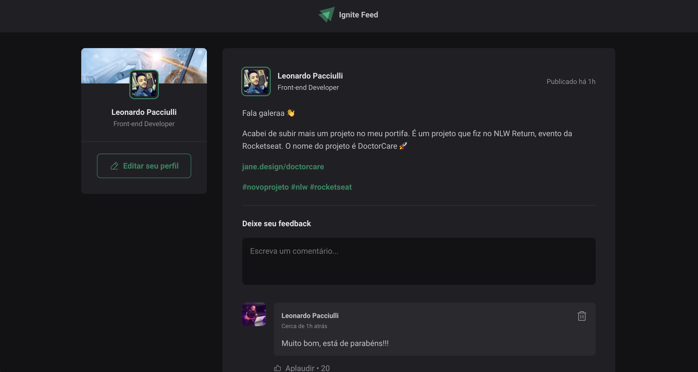

<h2 align="center">
  💻 In Development 💻
</h2>

 
 

  

 
 

### 📝 Sobre o projeto
Uma rede social "feed" contendo Posts de usuários, com possibilidade de deixar um feedback (comentário) no Post desejado, assim como ver comentários de outros usuários.

 
 

### 🖥 Front-End
Um projeto criado com ReactJS utilizando o ViteJS (https://vitejs.dev/guide/);
 
Typescript;
 
CSS module;